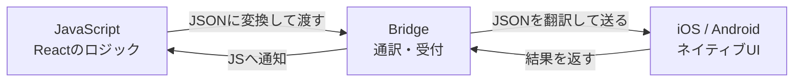
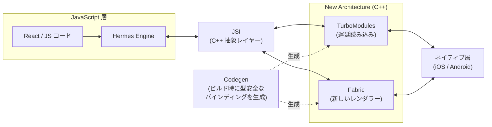
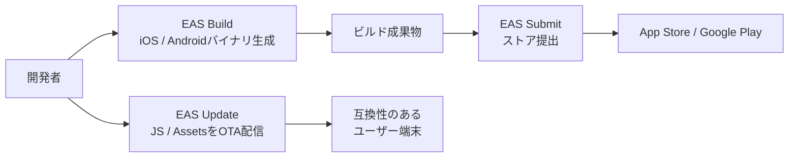
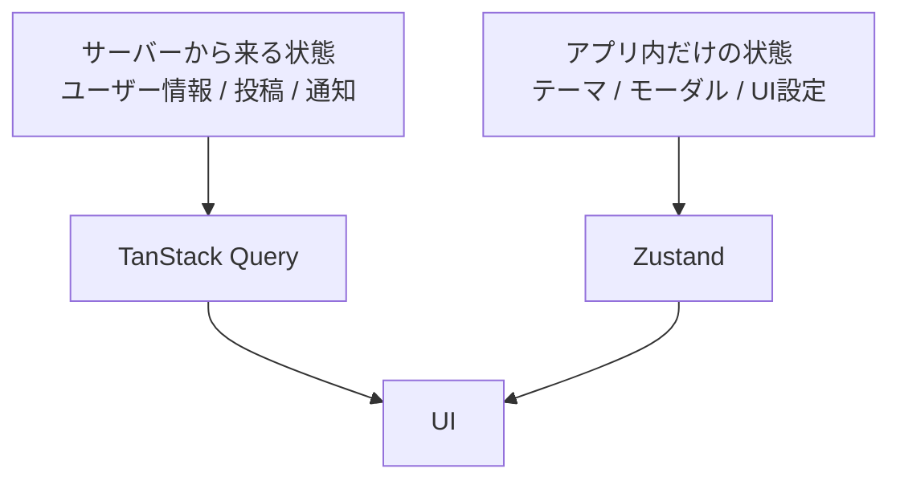

:::message
この記事は、[CYBOZU SUMMER BLOG FES '26](https://summer-blog-fes.cybozu.io/2026/)の記事です。
:::

## はじめに

さて、今年も夏がやってきましたね。みなさん、夏休みの過ごし方はもう決まりましたか？

私は「今年こそ積んでた技術書を消化するぞ」とひそかに誓っているのですが、どうせ気づいたらYouTubeで虎とライオンが喧嘩する動画を3時間見ている——そんな未来がうっすら見えています。

そんなどうでもいい余談は置いといて、普段ReactでWebフロントを書いているみなさん、App StoreやGoogle Playからアプリをダウンロードするたびに「これ、もしかしてReact Native（以降、RN）でサクッと作れるのでは？」と思ったことはありませんか？そう、Reactを書ける人は全員、心のどこかでモバイルアプリを書きたくてしょうがないはずです（暴論）。

でも同時に、RN界隈で聞くこんな評判に、足を止めてきた人もいるはずです。

- RN自体が遅い。作ったアプリが使い物にならない。
- RN本体のバージョンアップが地獄。上げたらビルドが壊れ、戻しても壊れる。
- ナビゲーションライブラリ選定が地獄。選んだやつがだいたい半年後にEOLになる。
- デバッグが地獄。スタックトレースが何も教えてくれない。
- ストア公開が地獄。ビルド提出、証明書、プロビジョニングプロファイル……と永遠に終わらない「行政手続き」

ですが、2026年時点のRNとその周辺エコシステムはここ数年で劇的に進化していて、正直に言うと「Next.jsでWebアプリを作るのと同じ脳みそ」でiOS/Androidアプリが作れる「優しい世界」になっています。

この記事では、2026年現在のRNベースのモバイルアプリ開発の全体像を、Reactの経験があるWeb開発者向けに整理し、「そこそこ鮮度の良いRN開発の地図」を1本作り上げることに挑戦します。この夏休み、その地図を片手に、モバイルアプリ開発の世界へ冒険に出てみませんか？

## 昔のReact Nativeは、なぜ「遅かった」のか

認めよう、昔のRNは遅かった。

画面は普通にカクつくし、長いリストを勢いよくスクロールすると、描画待ちで空のセルが一瞬表示されるのも日常茶飯事でした。そして諸悪の根源は、JavaScriptとネイティブ間の通信のボトルネックにありました。

「通信って何の話？」となりますよね。その答えを見つけるために、まずRN 0.75まで主流だった旧アーキテクチャの仕組みから見ていきましょう。

React Nativeの中では、大きく2つの世界が動いています。

- JavaScriptの世界：われわれが書くReactコード（ロジック担当）
- ネイティブの世界：iOS/Androidの実際のUI部品（描画担当）

問題は、この2つの世界の会話の仕方でした。旧アーキテクチャでは、両者は直接話せず、Bridgeと呼ばれる橋渡し役を介して、JSONとしてシリアライズ可能なメッセージをバッチ化し、非同期で送り合っていました。これが「通信」というモノの正体です。



例えるなら、隣の席の同僚に「その資料ちょっと見せて」と言いたいだけなのに、毎回社内申請フォームを書いて、受付に出して、別部署の承認を待つようなものです。

単発ならまださほど問題ありませんが、モバイルアプリのように、アニメーション、ジェスチャー、スクロール、リスト描画など、細かいやり取りが連続して発生する世界では、すぐ渋滞が発生します。リストを勢いよくスクロールすると空のセルが一瞬見える現象にも、BridgeやJSスレッドの渋滞が影響していました。

## New Architectureで変わった世界

そこでRN 0.76から、JavaScriptとネイティブ間の通信基盤を刷新した「New Architecture」（ネーミングよ……）がデフォルトになりました。

全体像をざっくり表すとこんな感じです：



順番に見ていきましょう。

### JSI（JavaScript Interface）

JSIはC++で書かれた抽象レイヤーで、JSとネイティブ側がJSON変換を挟まずに直接参照を持てるようにし、必要な場面では同期呼び出しも可能にする仕組みです。

JSがネイティブ側のオブジェクトへの参照を直接持てるようになったので、Bridge時代のようなシリアライズの往復が不要になりました。必要であれば同期呼び出しもできるので、「今すぐこのViewのサイズを教えて」が、聞いたその場で返ってくる世界です。

この変化により、MMKVのような高速ストレージや、Reanimatedのようなパフォーマンス要求の高いライブラリがヌルヌルと動ける土台が整いました。

### Fabric

いわゆる新しいUI描画エンジン（レンダラー）です。

レンダラーとShadow Treeの主要部分がC++で共通化され、必要に応じてレンダリングパイプラインを同期実行できるようになりました。これにより画面表示の一貫性や応答性は大きく改善しました。

FabricはUI更新の優先度をより扱いやすくしています。例えばReact 18以降の並行レンダリング（SuspenseやTransitions）のように、「急ぎの描画を先に、後回しでいいものは後で」という優先度制御が、モバイルアプリ側でも可能になりました。

### TurboModules

TurboModulesは、新しいNative Moduleの仕組みです。

React Nativeアプリではカメラ、位置情報、通知、ストレージなどネイティブ側の機能を呼び出したい場面が多くあります。Bridge前提の旧Native Moduleでは、多くのモジュールを起動時に初期化する必要があり、起動時間やメモリ使用量に影響していました。

TurboModulesでは実際に必要になった瞬間に初めて初期化する、いわゆる遅延読み込み方式に変わったため、起動が速くなり、メモリ消費も減りました。

### Codegen

Codegenは、TypeScriptまたはFlowで記述した仕様から、ネイティブ側との橋渡しコードを生成する仕組みです。

JSIのおかげでシリアライズのプロセスが不要になったものの、JS側とネイティブ側では話す言語（型システム）が違います。Codegenは、TypeScriptやFlowの型定義を「仕様書」として読み取り、両者をつなぐ型安全なバインディングコードをビルド時に自動生成します。

Web開発でいえば、OpenAPIスキーマからAPIクライアントを自動生成するあの感覚です。「JSは数値を送ったのに、ネイティブは文字列を期待していて実行時クラッシュ」という古典的な悲劇が、コンパイル段階で防げるようになりました。

---

上記「四本柱」のほかに、JSエンジンもJavaScriptCore（JSC）からRN向けに最適化されたHermesへ移り、コールドスタートの高速化やメモリ使用量の削減が進みました。さらにRN 0.84からは、コンパイラとVMを刷新したHermes V1がデフォルトになっています。

New Architectureの良さをひと通り紹介したところで、結局われわれ開発者は何をすればいいの？と聞きたくなると思いますが、新規プロジェクトでNew Architectureを有効にするための特別な作業は、基本的に必要ありません。これがNew Architectureの一番いいところです。

最近のExpo SDK（後述）でプロジェクトを作れば、最初からNew Architecture上で動きます。Reactコードの基本的な書き方は変わらず、多くの恩恵をそのまま受けられます。

普段の画面開発でNew Architectureの内部を常に意識する必要はありません。ただし、ネイティブライブラリの互換性や同期APIのコストまで消えるわけではないので、依存ライブラリを追加・更新するときは対応状況を確認しましょう。それでもこの仕組みを知っておくと、アプリがヌルヌル動くたびに「RN、ほんとに変わったなぁ」としみじみ感心できるはずです。

:::message
「特別な有効化作業がいらない」のは新規プロジェクトの話です。既存アプリをNew Architectureへ移行する場合、いくつか注意事項があります：

- RN 0.82以降は旧アーキテクチャへ戻せないため、まずRN 0.81またはExpo SDK 54でNew Architectureを有効にし、段階的に検証する
- `setNativeProps`のような命令的APIは現在も利用できるものの、DOM Node APIなど新しい代替手段も確認する
- 並行レンダリングでは描画タイミングや副作用の前提が変わるため、移行後にVRTやE2Eテストで回帰を確認する
- 旧Bridgeの内部や独自Shadow Nodeに深く依存したライブラリは、互換レイヤーでも動かないことがある
- 自作の旧Native Moduleは互換レイヤーで動く場合もあるが、将来性を考えるとTurboModuleへの段階的な移行が推奨される

互換レイヤーが旧ライブラリの多くを支えているため、移行のハードルが数年前より下がっているのも事実です。ただし、採用前には[React Native Directory](https://reactnative.directory/)などでNew Architectureへの対応状況を確認しておくと安心です。
:::

## 技術選定の「定番」が見えやすくなってきた話

Web開発の技術選定って、「状態管理どうする？」「CSSどうする？」で会議が1024時間くらい溶けますよね。

実は昔のRNも同じでした。いや、もっとひどかった。ナビゲーションだけでも`react-navigation`、`react-native-navigation`、`react-native-router-flux`と紛らわしい名前の選択肢が乱立し、破壊的変更やメンテナンス状況を見極める必要がありました。UIライブラリもNativeBase、React Native Elements、UI Kittenと群雄割拠の状態で、「まずこれを選べばよい」と言える定番が見えにくかった。技術選定そのものが、地図のない冒険だった時代です。

しかし、2026年のRN界隈は、レイヤーごとの有力候補がかなり見えやすくなっています。新規プロジェクトなら、まずこの構成で始めて困ることはほぼないでしょう：

| レイヤー             | 推奨                  | 立ち位置                       |
| -------------------- | --------------------- | ------------------------------ |
| 言語                 | TypeScript            | もはや空気                     |
| フレームワーク       | Expo                  | Next.js + Vercelの役割を果たす |
| サーバー状態管理     | TanStack Query        | Webと同じものがそのまま動く    |
| クライアント状態管理 | Zustand               | Webと同じものがそのまま動く    |
| API通信              | fetch（+ Hono RPC）   | Webと同じ感覚で書ける          |
| フォーム             | React Hook Form + Zod | Webと同じ（以下略              |
| スタイリング         | NativeWind            | RN版Tailwind CSS               |
| UIコンポーネント     | gluestack-ui          | RN版shadcn/ui                  |
| ローカルストレージ   | MMKV                  | localStorageの超高速版         |
| バックエンド/認証    | Supabase              | Firebase的BaaS                 |

この構成のポイントは、役割分担がかなりWebフロントエンドに近いことです。

APIデータはTanStack Query、画面内の軽い状態はZustand、フォームはReact Hook Form + Zod、スタイリングはNativeWindでTailwind風に、バックエンドはSupabase、ルーティングはApp Routerのようなファイルベース……ReactでWeb開発やっている人なら、「あれ、知ってる顔が多いそ？」と感じるはずです。

そう、2026年のRN開発現場においては、Web開発の知識や経験を無駄なく再利用できる場面が多いです。

### Expo: 「便利ツール」から「標準レール」へ

Expoは昔、「便利な入門ツール」という位置づけで見られがちで、「本格的なアプリ開発には向かないのでは？」というイメージを持たれることもありました。なお、`expo eject`コマンドはSDK 46で削除され、現在は後述するCNGとPrebuildがその役割を担っています。

しかし2026年現在のExpoは、RNアプリを作るための「標準レール」に近い存在になっていて、RN公式ドキュメントも新規アプリにはフレームワークの利用を推奨し、その代表としてExpoを案内しているほどです。

Expoはコードを書くときだけではなく、アプリ開発で面倒になりやすい周辺部分をかなり引き受けてくれるところに真価を発揮します。

#### Expo Go & Development Build

モバイルアプリ開発でつまずきやすいのは、だいたい「画面を作る前」と「画面を作った後」です。

画面を作る前には、環境構築、ネイティブ設定、端末実行が待っています。画面を作った後には、ビルド、署名、配布、ストア提出、更新が待っています。ダルいです、ほんまに。

そんな画面を作る前の問題を颯爽と解決してくれるのがExpo GoとDevelopment Buildです。ただし、両者の役割は分けて理解する必要があります：

- Expo Go: Expoをすぐ試すための学習・プロトタイピング用サンドボックス
- Development Build: アプリ固有のネイティブコードや設定を含められる、実プロジェクト向けの開発用ビルド

Expo Goなら、対応するExpo SDKで開発サーバーを起動し、表示されたQRコードをスマホで読むだけで試せます。コードを保存するとFast Refreshで実機へすぐ反映されます。ケーブル不要、Xcodeの起動すら不要。開発体験はかなり`localhost`に近いです。


_Expo GOで開発中のアプリを実機で確認する様子(公式ドキュメントより)_

:::message alert
2026年7月14日時点はSDK 57への移行期間中です。公式ドキュメントでは、物理端末のExpo Goを使う場合はSDK 54を、SDK 57を使う場合はDevelopment Buildを選ぶよう案内されています。公開時点で状況が変わる可能性があるため、[create-expo-appの公式ドキュメント](https://docs.expo.dev/more/create-expo/)も確認してください。
:::

Expo Goに組み込まれていないネイティブライブラリを使う場合や、アプリ名・アイコン・権限文言など固有のネイティブ設定を反映する場合はDevelopment Buildを使います。ExpoはCNG（Continuous Native Generation）という仕組みを使って設定ファイル（`app.json`）から必要なネイティブプロジェクトを生成してくれます。

もう自分で`Info.plist`や`AndroidManifest.xml`を触る必要がほぼありません。何なら忘れてもいいぐらいです。`ios/`や`android/`フォルダを人間が手で管理する時代も終わりました。感動で泣いちゃいそう。

#### EAS

画面開発を終えて、いざストアに提出してアプリを配信しようと思った途端、証明書、プロビジョニングプロファイル、キーストアなどの「行政手続」に囲まれて萎縮してしまう経験は誰でも一度あったはずです。

画面を作った後の「行政手続」たちをかなり引き受けてくれるのが、EAS（Expo Application Services）というExpo公式のクラウドサービス群です。

特に重要なのは次の3つです：

- EAS Build: iOS / Androidのアプリバイナリをクラウドでビルドする
- EAS Submit: App Store / Google Playへの提出をコマンドラインから行う
- EAS Update: JavaScriptやアセットの更新をOTAで配信する



EAS Buildを使うと、クラウド上でビルドを実行し、成果物を管理できます。署名用の認証情報はEASに管理を任せることも、ローカルで管理することもできます。そして、Buildとよくセットで使われるEAS Submitは、ビルドしたアプリをストアへ提出する作業をコマンドから実行できる優れ者です。

EASと各ストアの初期設定が終わっていれば、例えばiOSの本番ビルドと提出は次の2コマンドで実行できます：

```bash
# EAS上でiOSの本番ビルドを実行
eas build --platform ios --profile production

# 最新の本番ビルドをApp Store Connectへ提出
eas submit --platform ios --profile production --latest
```

Macを持っていなくても、クラウド上でiOSアプリをビルドできます。Vercelに`git push`したらデプロイされる、あの感覚に近いです。

さらにEAS Update（OTA更新）もかなり便利です。JS、スタイル、画像など非ネイティブ部分の修正なら、ストア審査を待たずに配信できます。更新は設定に応じてダウンロードされ、次回アプリ起動時やリロード時に反映されます。「typo見つけた！」→修正→ビルド→審査待ち😇ともお別れで、修正入れた数分でユーザーの端末に届くという世界観です。

#### Expo Router

RNで画面遷移を取り扱う代表的な選択肢はReact Navigationですが、せっかくExpoを使うなら公式でも推奨しているExpo Routerのほうがおすすめです。

Expo Router自身はReact Navigationを土台に構築されていますが、`app`ディレクトリのファイル構造からルーティングシステムを作る、いわゆるファイルベースルーティングを実現しています。Next.jsのApp Routerに似た開発体験です。

```
app/
├── _layout.tsx      # ルートレイアウト
├── (tabs)/          # タブグループ
│   ├── _layout.tsx  # タブナビゲーション定義
│   ├── index.tsx    # ホームタブ
│   └── settings.tsx # 設定タブ
└── users/
    └── [id].tsx     # もちろん、動的ルートにも対応
```

ルーティングを細かく独自制御したいという需要がなければ、まずExpo Routerを検討しましょう。

### 状態管理

RNに限らず、Reactアプリの状態管理は長いあいだ悩みの種でした。

昔は「とりあえずReduxに入れる」が強かった時期があります。もちろんReduxは今でも強力ですし、大規模なユースケースでは選択肢になります。ただ、2026年に新しくRNアプリを作るなら、まず考えたいのは次のような役割分担です：



つまり、RNアプリでの状態は大きく2種類に分けられます：

- Server State: サーバーに本体があるデータ
- Client State: アプリ内に本体がある状態

この分離ができるだけで、状態管理の見通しはかなり良くなります。

#### Server State: TanStack Queryにお任せ

Web開発でお馴染みのTanStack QueryはReact Nativeでも使えます。データのプリフェッチから、キャッシュ管理、ミューテーション、ページネーションや無限スクロールまで、Webでできた操作をほぼ同じ感覚でモバイルアプリでも扱えます。

たとえば、ユーザーのプロフィール取得処理はこう書けます：

```tsx
import { useQuery } from "@tanstack/react-query";
import { z } from "zod";

const profileSchema = z.object({
  id: z.string(),
  name: z.string(),
  avatarUrl: z.url().nullable(),
});

async function fetchProfile(userId: string) {
  const res = await fetch(`https://api.example.com/users/${userId}`);

  if (!res.ok) {
    throw new Error("プロフィールの取得に失敗しました");
  }
  return profileSchema.parse(await res.json());
}

export function useProfile(userId: string) {
  return useQuery({
    queryKey: ["profile", userId],
    queryFn: () => fetchProfile(userId),
  });
}
```

画面側はこうです：

```tsx
import { Text, View } from "react-native";
import { useProfile } from "@/features/profile/hooks";

export function ProfileHeader({ userId }: { userId: string }) {
  const profile = useProfile(userId);

  if (profile.isPending) return <Text>読み込み中……</Text>;
  if (profile.isError) return <Text>プロフィールを読み込めませんでした</Text>;

  return (
    <View>
      <Text>{profile.data.name}</Text>
    </View>
  );
}
```

:::message
TanStack Query自体はRNでもそのまま動きますが、「アプリがフォアグラウンドへ戻った」「ネットワークへ再接続した」など、モバイル固有の状態は別途で対処する必要があります。実プロジェクトでは`AppState`と`focusManager`、NetInfoまたは`expo-network`と`onlineManager`を連携させるのが定番です。詳しくは[TanStack QueryのReact Nativeガイド](https://tanstack.com/query/latest/docs/framework/react/react-native)を参照してください。
:::

#### Client State: 「ちょうどいい」Zustand

アプリ内部で完結する状態にはZustandが扱いやすいです。

Zustandは小さく、APIが素直で、ボイラープレートが少ないところが強みです。モバイルアプリの多くのClient StateにはZustandくらいの軽さがちょうどいいです。

たとえば、テーマ設定の状態管理は数行程度でサクッと書けます：

```ts
import { create } from "zustand";

type Theme = "light" | "dark" | "system";

type ThemeState = {
  theme: Theme;
  setTheme: (theme: Theme) => void;
};

export const useThemeStore = create<ThemeState>((set) => ({
  theme: "system",
  setTheme: (theme) => set({ theme }),
}));
```

画面では気軽に呼び出せます：

```tsx
import { Pressable, Text } from "react-native";
import { useThemeStore } from "@/stores/themeStore";

export function ThemeButton() {
  const theme = useThemeStore((state) => state.theme);
  const setTheme = useThemeStore((state) => state.setTheme);

  return (
    <Pressable onPress={() => setTheme(theme === "dark" ? "light" : "dark")}>
      <Text>現在のテーマ: {theme}</Text>
    </Pressable>
  );
}
```

ご覧の通り、TanStack QueryもZustandもWeb開発で書いたコードをほぼそのまま流用できます。例えば、先にモバイルアプリを作って、将来的にWeb版へもサービスを拡大したくなったら、多くの場合状態管理のコードをそのまま流用できます。

もう状態管理のライブラリ選定だけで頭を悩ませる日々とはお別れですね。

### API通信: Honoのススメ

RNでのAPI通信は、Webと同じ`fetch`がそのまま使えます。TanStack Queryと組み合わせれば、正直それだけで8割のユースケースに対処できます。

ただ、バックエンドも自分で書くなら（個人開発でもよくある構成です）、Honoという選択肢を知ってほしい。Honoは軽量なWebフレームワークで、Cloudflare Workers、Bun、Node.jsなどさまざまなランタイムで動きます。

RNアプリのバックエンドやBFFをTypeScriptで書きたい場合、Honoは相性抜群です。特にHono RPCを使うと、サーバー側のルート定義からクライアント側の型を推論できちゃいます。

例えばサーバー側のAPIを次のように定義すると、

```ts
import { Hono } from "hono";
import { zValidator } from "@hono/zod-validator";
import { z } from "zod";

const app = new Hono()
  .get("/todos", (c) => {
    return c.json({ todos: [{ id: 1, title: "牛乳を買う", done: false }] });
  })
  .post(
    "/todos",
    zValidator("json", z.object({ title: z.string().min(1) })),
    (c) => {
      const { title } = c.req.valid("json"); // ここで既に型安全
      return c.json({ ok: true, title }, 201);
    },
  );

export type AppType = typeof app; // ← この型をエクスポートするだけ
```

クライアント側ではその型を使って呼び出せます：

```ts
import { hc } from "hono/client";
import type { AppType } from "../../../server"; // 型だけimport

export const client = hc<AppType>("https://api.example.com");

// 使う側：TanStack Queryと組み合わせる
const { data } = useQuery({
  queryKey: ["todos"],
  queryFn: async () => {
    const res = await client.todos.$get();
    return res.json(); // ← 戻り値が完全に型付き！
  },
});
```

`client.todos.$get()`と打つと、エンドポイントのパスもメソッドもレスポンスの型も、まとめてエディタが補完してくれます。サーバー側でレスポンスの形を変えたら、アプリ側のコードがその場で型エラーになる。OpenAPIのコード生成を挟まず、TypeScriptの型をサーバーとクライアントで共有できます。

:::message
モノレポでHono RPCを使う場合、サーバーとクライアントの`tsconfig.json`両方で`"strict": true`にすること、Honoのバージョンを揃えることがハマりポイントです。
:::

### React Hook Form + Zodでフォームも幸せ

モバイルアプリはフォームだらけです。ログイン、会員登録、プロフィール編集、検索条件、決済情報、問い合わせ……フォームが使いにくいアプリは、それだけで体験が悪くなります。

RNでのフォーム管理においても、Web開発でもはや定番コンビになっているReact Hook Form + Zodがほぼそのまま動きます。

```tsx
import { useForm, Controller } from "react-hook-form";
import { zodResolver } from "@hookform/resolvers/zod";
import { z } from "zod";
import { TextInput, Text, Button, View } from "react-native";

const schema = z.object({
  email: z.email("メールアドレスの形式が正しくありません"),
  password: z.string().min(8, "8文字以上で入力してください"),
});

type FormData = z.infer<typeof schema>;

export function SignInForm() {
  const {
    control,
    handleSubmit,
    formState: { errors },
  } = useForm<FormData>({
    resolver: zodResolver(schema),
    defaultValues: {
      email: "",
      password: "",
    },
  });

  const onSubmit = (data: FormData) => {};

  return (
    <View>
      <Controller
        control={control}
        name="email"
        render={({ field: { onChange, onBlur, value, ref } }) => (
          <TextInput
            ref={ref}
            value={value}
            onChangeText={onChange}
            onBlur={onBlur}
            placeholder="メールアドレス"
            autoCapitalize="none"
            keyboardType="email-address"
          />
        )}
      />
      {errors.email && <Text>{errors.email.message}</Text>}

      <Controller
        control={control}
        name="password"
        render={({ field: { onChange, onBlur, value, ref } }) => (
          <TextInput
            ref={ref}
            value={value}
            onChangeText={onChange}
            onBlur={onBlur}
            placeholder="パスワード"
            secureTextEntry
          />
        )}
      />
      {errors.password && <Text>{errors.password.message}</Text>}

      <Button title="ログイン" onPress={handleSubmit(onSubmit)} />
    </View>
  );
}
```

役割分担もWebとさほど変わりません。

- React Hook Form: 入力状態、エラー、submit、dirty状態などを管理する
- Zod: 入力値が正しい形かどうかを検証し、型も作る

Webとの違いは、`<input>`の代わりに`Controller`で`TextInput`を包むことくらい。

フォームは小さいうちは何となく書けます。でも、項目が増え、条件分岐が増え、バリデーションが増えると、一気に絡まります。React Hook Form + Zodは、その絡まりを最初からほどきやすくしてくれるので、初期段階から導入するのはおすすめです。

### スタイリング & UIライブラリ

モバイルアプリの世界にはDOMという概念がないため、CSSも当然ありません。従って、RNでのスタイリングは、Webの世界とはそこそこ違いがあります。

RNのスタイリングは`StyleSheet.create`と`style`オブジェクトを使って書くのが標準的です。

```tsx
import { View, Text, Image, StyleSheet } from "react-native";

export function ProfileCard() {
  return (
    <View style={styles.card}>
      <Image
        source={{ uri: "https://example.com/avatar.png" }}
        style={styles.avatar}
      />
      {/* 複数スタイルは配列でマージ（後ろのほうが勝つ） */}
      <View style={[styles.textArea, { flex: 1 }]}>
        <Text style={styles.name}>シャオハイ</Text>
        <Text style={styles.bio}>ゲームエンジニア</Text>
      </View>
    </View>
  );
}

const styles = StyleSheet.create({
  card: {
    flexDirection: "row",
    alignItems: "center",
    gap: 12,
    padding: 16,
    backgroundColor: "#fff",
    borderRadius: 12,
    boxShadow: [
      {
        offsetX: 0,
        offsetY: 2,
        blurRadius: 8,
        spreadDistance: 0,
        color: "rgba(0, 0, 0, 0.1)",
      },
    ],
  },
  avatar: {
    width: 56, // 論理ピクセル
    height: 56,
    borderRadius: "50%",
  },
  textArea: {
    gap: 4,
  },
  name: {
    fontSize: 16,
    fontWeight: "600",
    color: "#111",
  },
  bio: {
    fontSize: 13,
    color: "#666",
  },
});
```

このようにそれっぽく書けますが、「今さらCSS-in-JSと言われてもなぁ……」と思う人も少なくないはずです。

#### NativeWind

名前から察した通り、NativeWindはTailwind CSSのようなutility-firstの書き方をRNに持ち込むライブラリです。

```tsx
import { Text, View } from "react-native";

export function Card() {
  return (
    <View className="rounded-2xl bg-white p-4 shadow-sm">
      <Text className="text-lg font-bold text-zinc-900">
        React Native、だいぶ優しくなったね
      </Text>
      <Text className="mt-2 text-sm text-zinc-600">
        でもAndroidの端末差分はまだたまに牙をむく
      </Text>
    </View>
  );
}
```

Tailwindに慣れている人なら、かなり入りやすいです。

NativeWindはビルド時にTailwind CSSのスタイルを`StyleSheet.create`オブジェクトへコンパイルし、実行時にはhover、focus、メディアクエリなどの条件に応じてスタイルを適用する軽量なランタイムを使います。完全なゼロランタイムではありませんが、ネイティブのStyleSheetを生かしつつ、ダークモードも`dark:`プレフィックスでWebと近い書き味を実現しています。

#### gluestack-ui

スタイリングだけでは物足りず、UIライブラリがほしい場面には、`gluestack-ui`という選択肢があります。

「RN版shadcn/ui」のような位置づけで、まさにshadcn流のコピペ方式——CLIで必要なコンポーネントのコードを自分のプロジェクトに追加し、自由に改造できます。

```bash
# 最初にプロジェクトを初期化する
npx gluestack-ui@latest init

# 必要なコンポーネントを追加する
npx gluestack-ui@latest add button
# → components/ui/button/ にコードが生えるので、あとは煮るなり焼くなり
```

スタイリングはNativeWindベースなので、スタイル調整したい時にTailwind風の書き味をそのまま継承します。「UIライブラリのテーマカスタマイズ方法を覚える」という無駄な学習コストが発生しません。shadcn/uiで慣れたあの開発フローが、そのままモバイルに持ち込めます。

### ローカルストレージ: 「小さくて速い引き出し」MMKV

「ちょっとした設定値やオンボーディング済みフラグをローカルに保存したい」場面においては、Webなら`localStorage`の出番ですが、RN界隈では昔からAsyncStorageがよく使われてきました。

ただ、2026年にパフォーマンスやNew Architectureとの相性を意識するなら、MMKV（`react-native-mmkv`）はかなり有力な選択肢です。

MMKVはWeChatが開発したC++製のkey-valueストレージで、New ArchitectureのJSI経由で動くためAsyncStorage比で約30倍高速、同期的に値を読み書きもできます：

```ts
// lib/storage.ts
import { createMMKV } from "react-native-mmkv";

export const storage = createMMKV();

// localStorageと同じノリで、awaitなしで書ける
storage.set("onboardingDone", true);
const done = storage.getBoolean("onboardingDone"); // 同期で即取得
```

`await`が要らないので、「起動時に設定を読んでから画面を出す」ような処理で非同期の待ちが発生しません。一方、同期処理はJSスレッド上で完了を待つため、大きな値や高頻度の読み書きには向きません。Zustandの`persist`ミドルウェアと組み合わせ、設定値などをMMKVに永続化するのも定番パターンです。

:::message alert
JWTなどの機密情報は、暗号化されないストレージ（AsyncStorageや素のMMKV）には保存しないのが鉄則。`expo-secure-store`でOSのセキュア領域（Keychain / Keystore）に保存しましょう。
:::

### Supabaseで楽になるバックエンドと認証まわり

個人開発でDBと認証を自前で立てるのは、夏休みの自由研究としては重すぎます。

個人開発や小〜中規模プロダクトで、RNアプリのバックエンドを素早く用意したいなら、Supabaseはかなり有力候補です。PostgreSQLベースで、DB・認証・ストレージ・リアルタイム購読などがワンストップで手に入ります。

Expoとの相性も良くて、お互いの公式ドキュメントにも連携ガイドがあるほどです。

Expo + Supabaseの初期化イメージはこうです：

```ts
import "react-native-url-polyfill/auto";
import { createClient } from "@supabase/supabase-js";
import "expo-sqlite/localStorage/install";

const supabaseUrl = process.env.EXPO_PUBLIC_SUPABASE_URL!;
const supabasePublishableKey =
  process.env.EXPO_PUBLIC_SUPABASE_PUBLISHABLE_KEY!;

export const supabase = createClient(supabaseUrl, supabasePublishableKey, {
  auth: {
    storage: localStorage,
    autoRefreshToken: true,
    persistSession: true,
    detectSessionInUrl: false,
  },
});
```

```ts
// メール・パスワード認証も1行だけ
const { error } = await supabase.auth.signInWithPassword({ email, password });
```

DBへのアクセスも型付きクライアントで書けて、RLS（Row Level Security）でセキュリティルールをDB側に寄せられます。「認証まわりだけで1週間溶けた😇」という怪談は、もう過去のものです。

ちなみに、認可や複雑なビジネスロジックなどをAPI層に集約したい場合は、前述のHonoをSupabaseの手前に置く構成（RN → Hono → Supabase）も定番人気メニューです。型安全RPCとBaaSのいいとこ取りができます。

### おすすめのディレクトリ構成

RNアプリのディレクトリ構成は、画面単位だけでなく、機能単位で整理すると見通しが良くなります。

特にExpo Routerを使う場合、`app/`はルーティングの入口として使い、実装の本体は`src/features`以下に寄せる構成が扱いやすいです。

その前提で、ここまで紹介してきた技術を組み込んだ実践的なディレクトリ構成がこちらです：

```
my-rn-app/
├── app/                        # Expo Router前提
│   ├── _layout.tsx             # ルートレイアウト（Provider類はここ）
│   ├── +not-found.tsx          # 存在しないルートアクセス時の案内画面（Webでいう404）
│   ├── (auth)/                 # ログイン・認証まわり
│   │   ├── sign-in.tsx
│   │   └── sign-up.tsx
│   └── (tabs)/                 # ログイン後のタブ画面
│       ├── _layout.tsx
│       ├── index.tsx           # ホーム
│       └── settings.tsx
├── assets/                     # app.jsonやアプリコードから使う静的リソース
│   ├── images/                 # アプリアイコン、スプラッシュ、イラストなど
│   └── fonts/                  # カスタムフォント
├── src/
│   ├── features/               # 機能単位で縦に切る
│   │   └── todo/
│   │       ├── api.ts          # このfeatureのAPI呼び出し
│   │       ├── hooks.ts        # useTodos()等（TanStack Query）
│   │       ├── schema.ts       # 画面・機能固有のZodスキーマ
│   │       └── components/     # この機能専用のUI
│   ├── shared/                 # 機能をまたぐ共通レイヤ
│   │   ├── api/
│   │   │   ├── client.ts       # APIクライアントの本体
│   │   │   ├── queryClient.ts  # TanStack Query設定関連
│   │   │   └── mobileEvents.ts # AppState / onlineManager連携
│   │   ├── components/         # 共通UIコンポーネント
│   │   │   └── ui/             # gluestack-ui（ライブラリからのコピペ）
│   │   ├── lib/
│   │   │   ├── supabase.ts     # Supabase設定関連
│   │   │   └── storage.ts      # MMKVのラッパー
│   │   ├── styles/             # デザイントークン・共通スタイル
│   │   │   └── theme.ts
│   │   └── utils/              # 日付整形などの汎用関数
│   └── stores/                 # Zustand（アプリ全体のクライアント状態）
│       └── useSettingsStore.ts
├── app.json                    # Expo設定・Config Pluginの宣言
├── eas.json                    # EASビルド設定
├── global.css                  # NativeWindのCSS入口
└── metro.config.js             # Metro（開発サーバー）の設定
```

押さえておきたいポイントは3つです：

- `app/`は画面の置き場に徹する：ロジックは`src/features/`へ。画面ファイルは「featuresの部品を並べるだけ」の薄さを保つと、Expo Routerのファイルベース構造ときれいに共存できます。
- 依存の方向は一方通行：`features/` → `shared/`のimportはOK、逆の`shared/` → `features/`は禁止。このルール一つで、「共通部品のつもりが特定機能と癒着していた」という泥沼を防げます。
- 機能単位（features）で縦に切る：`api.ts` / `hooks.ts` / `schema.ts`が機能ごとに揃っていると、AIコーディングエージェントに「todoと同じ構成でbookmark機能を作って」と頼みやすいという、2026年らしい副次効果もあります。

## おわりに

ここまで読んでくれたあなたなら、もう気づいているはずです。

2026年のRN開発を取り巻く技術スタックには、「Webの知識を再利用できる」ものが数多くあります：

- TypeScript
- TanStack Query / Zustand / React Hook Form / Zod
- Expo Router → Next.js App Routerに似たファイルベースの開発体験
- NativeWind → Tailwindの書き味
- gluestack-ui → shadcn/uiの開発フロー
- Hono / Supabase → Webのバックエンド構成と共通

かつて「Swiftを覚えて、Xcodeと格闘して、証明書地獄をくぐり抜けて」という印象が強かったモバイル開発も、まず試作を始めるだけなら`npx create-expo-app@latest --template default@sdk-57`から入れるところまで参入コストが下がりました。そしてNew Architectureによって、RNが抱えていた性能上の制約も大きく改善されています。

自分の作ったアプリが、自分のスマホのホーム画面に並ぶ。通知が届く。友達に「これ俺が作ったアプリ」とQRコードを見せられる——この体験は、Webのデプロイとはまた違う、独特の楽しさがあります。

この夏、「Webの外」に一歩踏み出して、モバイルアプリの世界へと冒険してみませんか。

## 参考リンク

- [React Native New Architecture 公式ドキュメント](https://reactnative.dev/architecture/landing-page)
- [React Native 0.82 - New Architecture Only](https://reactnative.dev/blog/2025/10/08/react-native-0.82)
- [React Native 0.86 - FlatList](https://reactnative.dev/docs/flatlist)
- [Expo 公式ドキュメント](https://docs.expo.dev/)
- [Expo SDK対応表](https://docs.expo.dev/versions/latest/)
- [Expo GoとDevelopment Buildの違い](https://docs.expo.dev/develop/development-builds/introduction/)
- [Expo CNG](https://docs.expo.dev/workflow/continuous-native-generation/)
- [EAS Update](https://docs.expo.dev/eas-update/introduction/)
- [Hono - RPC ガイド](https://hono.dev/docs/guides/rpc)
- [TanStack Query - React Native](https://tanstack.com/query/latest/docs/framework/react/react-native)
- [react-native-mmkv](https://github.com/mrousavy/react-native-mmkv)
- [gluestack-ui CLI](https://gluestack.io/ui/docs/home/getting-started/cli)
- [NativeWind](https://www.nativewind.dev/)
- [Supabase - Expo React Native Quickstart](https://supabase.com/docs/guides/getting-started/quickstarts/expo-react-native)
